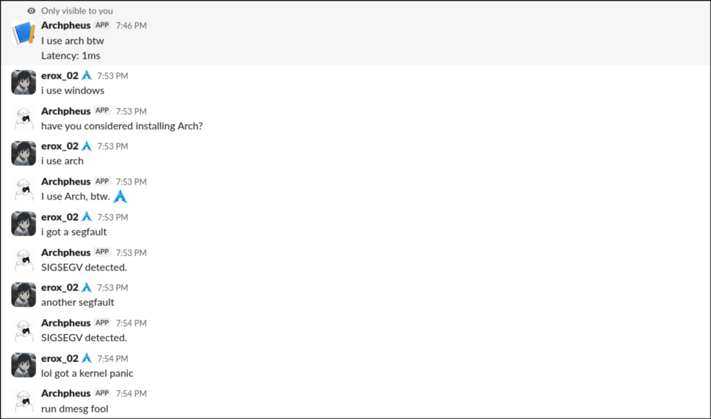

# Archpheus

A simple bot that responds to arch related keywords.

## hosting

Hosted on Nest.

[LINK_TO_NEST]{https://nest.hackclub.com}

> the link just redirects to nest not to my project

## Tree

```
[erox@archbtw archpheus]$ tree | wl-copy
.
├── env
├── index.js
├── package.json
├── package-lock.json
├── README.md
└── src
    ├── trig
    │   └── index.js
    └── util

4 directories, 6 files
```
## Photos



## Triggers

* `segfault`
* `kernel panic`
* `Arch`
* Linux/kernel errors
* `Windows`

Responses are randomly selected from the matching trigger.
